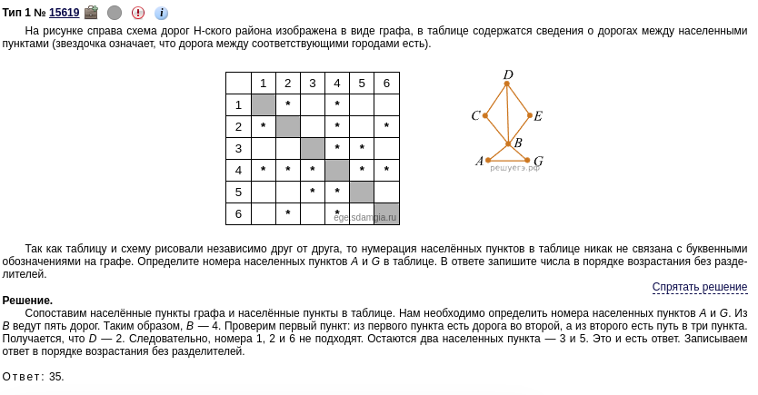
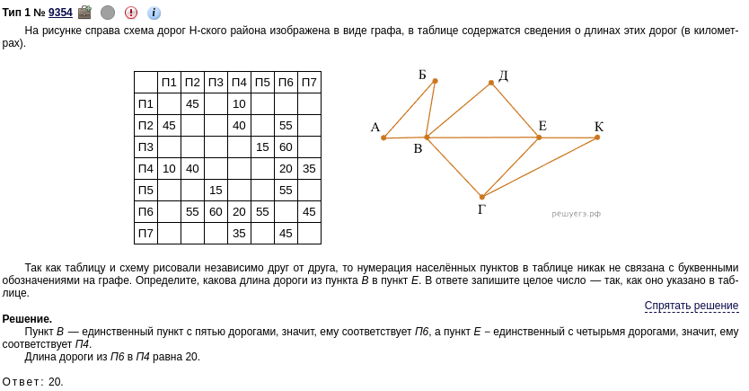
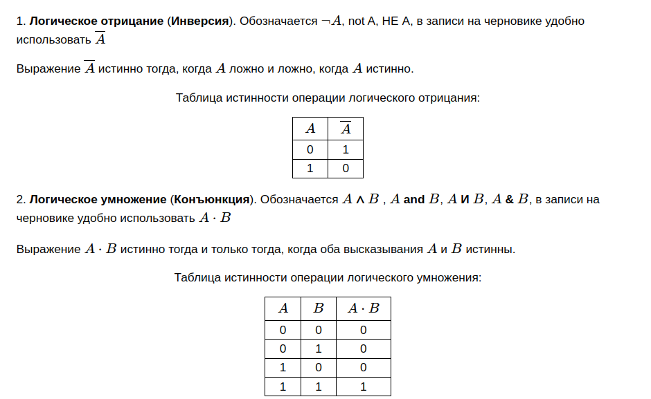
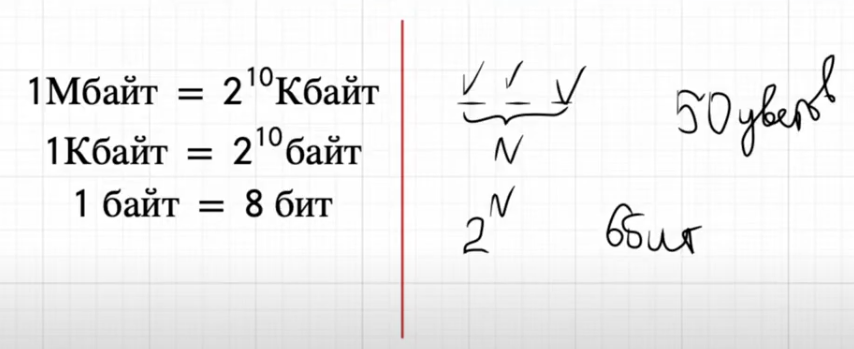
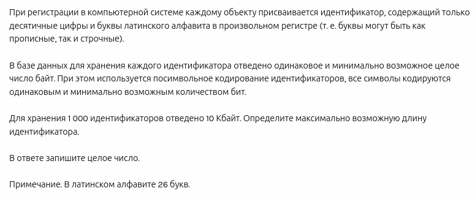
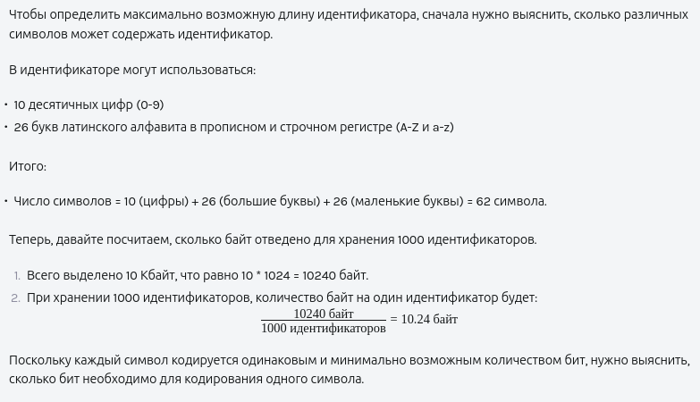
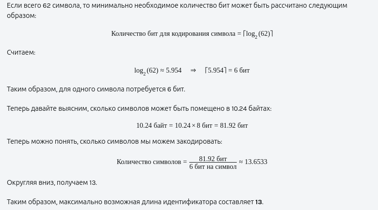

# computer-science-exam-reference-book

## Задание 1

### Неоднозначное соотнесение таблицы и графа


### Однозначное соотнесение таблицы и графа


## Задание 2

### Теория





### Пример

```python
print('x y z w | f')
for x in 0, 1:
    for y in 0, 1:
        for z in 0, 1:
            for w in 0, 1:
                f = (x or y) and (not z and w)  # логическая функция
                if f == 1:
                    print(x, y, z, w, '|', f)
```

## Задание 3

Всё очевидно

## Задание 4
## Задание 5

```python
def from_base_to_5(N):
    if N == 0:
        return 0
    r = ''
    while N > 0:
        r = str(N % 5)+r
        N //= 5
    return r
```

## Задание 6
## Задание 7



## Задание 8
## Задание 9

```python
c = 0
f = open('09.csv')
for s in f:
    a = list(map(int, s.split(';')))
    a.sort()
    if a[0]**2 + a[1]**2 > a[2]**2:
        c+=1
print(c)
```

```python
f = open('09.txt')
c = 0
for i in f:
    l = [int(x) for x in i.split()]
    repeat = [x for x in l if l.count(x) == 2]
    nonrepeat = [x for x in l if l.count(x) == 1]
    if len(repeat) == 4 and len(nonrepeat) == 2 and sum(repeat) // 2 < sum(nonrepeat):
        c += 1
print(c)
```

```python
f = open('09.txt')
c = 0
for s in f:
    a=list(map(int, s.split()))
    p = []
    if len(set(a)) == 4:
        for i in range(len(a)):
            if a.count(a[i]) == 2:
                p.append(a[i])
        if len(p)==4:
            if sum(set(p))<(sum(a)-sum(p)):
                c+=1
print(c)
```

## Задание 10
## Задание 11





## Задание 12

```python
def f(a: str):
    while '52' in a or '2222' in a or '1112' in a:
        if '52' in a:
            a = a.replace('52', '11', 1)
        if '2222' in a:
            a = a.replace('2222', '5', 1)
        if '1112' in a:
            a = a.replace('1112', '2', 1)
    return a

for n in range(3, 10_000):
    r = f('5'+n*'2')
    if sum([int(i) for i in r]) == 1685:
        print(n)
```

## Задание 13
## Задание 14
## Задание 15
## Задание 16

```python
import functools
@functools.lru_cache()
def F(n):
    if n < 7:
        return 7
    else:
        return 2 * n + F(n - 1)
print(F(2024) - F(2022))
```

```python
import sys
sys.setrecursionlimit(10**6)
def F(n):
    if n < 7:
        return 7
    else:
        return 2 * n + F(n - 1)
print(F(2024) - F(2022))
```

## Задание 17

```python
results = []
f = open('17.txt')
l = [int(i) for i in f]
for i in range(len(l) - 2):
    if (l[i]%3==0)+(l[i+1]%3==0)+(l[i+2]%3==0)==2:
        results.append(l[i]+ l[i + 1])
print(len(results), max(results))
```

## Задание 18
## Задание 19
## Задание 20
## Задание 21
## Задание 22
## Задание 23
## Задание 24
## Задание 25
## Задание 26
## Задание 27
