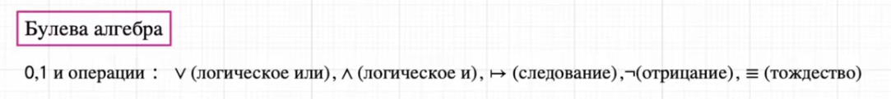
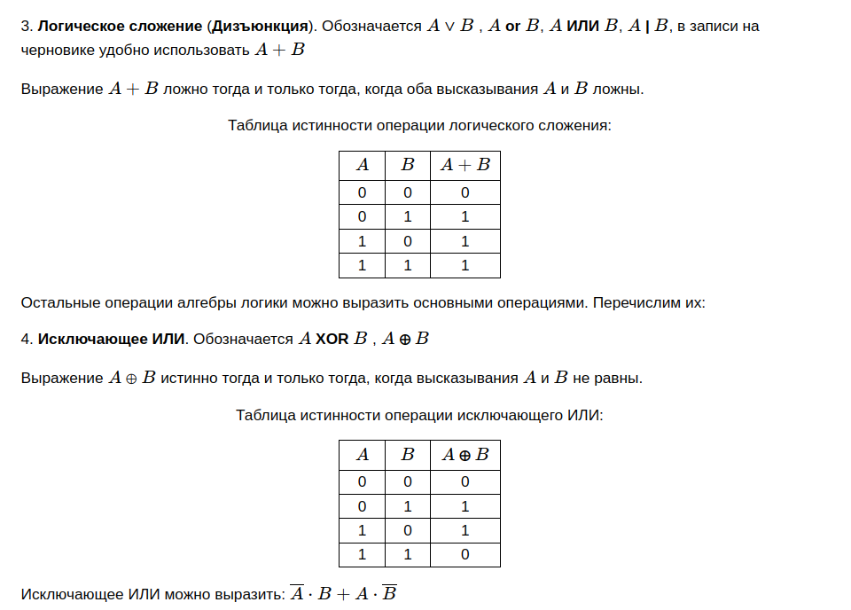
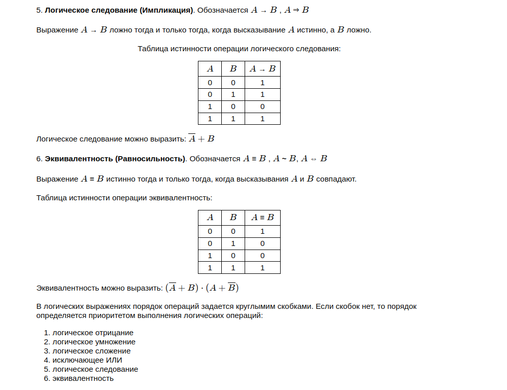

# computer-science-exam-reference-book

## Задание 1
## Задание 2

### Теория






### Пример

```python
print('x y z w | f')
for x in 0, 1:
    for y in 0, 1:
        for z in 0, 1:
            for w in 0, 1:
                f = (x or y) and (not z and w)  # логическая функция
                if f == 1:
                    print(x, y, z, w, '|', f)
```

## Задание 3
## Задание 4
## Задание 5
## Задание 6
## Задание 7
## Задание 8
## Задание 9
## Задание 10
## Задание 11
## Задание 12
## Задание 13
## Задание 14
## Задание 15
## Задание 16

```python
import functools
@functools.lru_cache()
def F(n):
    if n < 7:
        return 7
    else:
        return 2 * n + F(n - 1)
print(F(2024) - F(2022))
```

```python
import sys
sys.setrecursionlimit(10**6)
def F(n):
    if n < 7:
        return 7
    else:
        return 2 * n + F(n - 1)
print(F(2024) - F(2022))
```

## Задание 17

```python
results = []
f = open('17.txt')
l = [int(i) for i in f]
for i in range(len(l) - 2):
    if (l[i]%3==0)+(l[i+1]%3==0)+(l[i+2]%3==0)==2:
        results.append(l[i]+ l[i + 1])
print(len(results), max(results))
```

## Задание 18
## Задание 19
## Задание 20
## Задание 21
## Задание 22
## Задание 23
## Задание 24
## Задание 25
## Задание 26
## Задание 27
